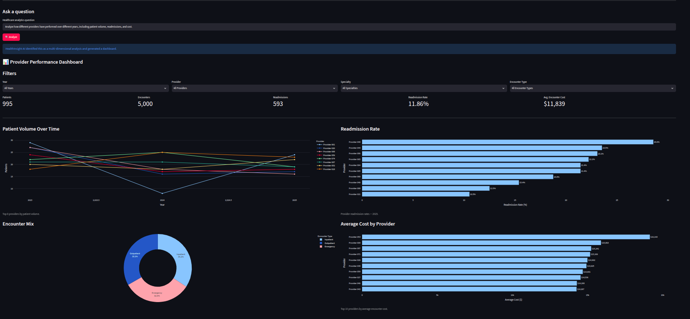
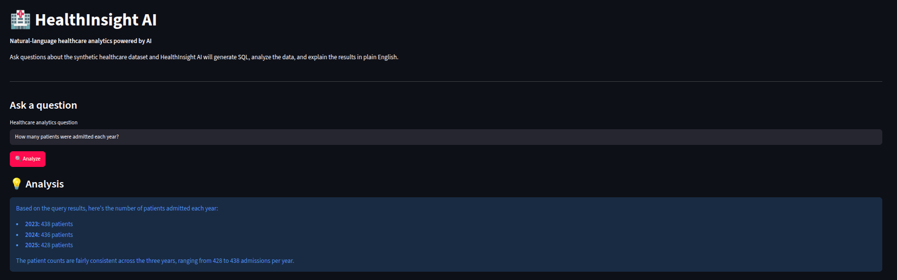
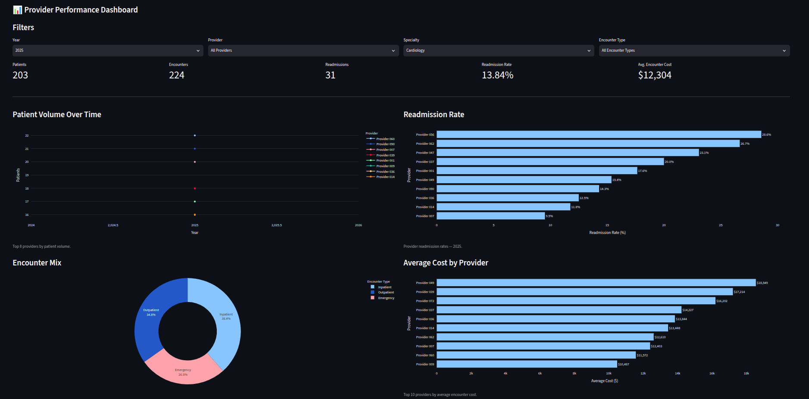

# 🏥 HealthInsight AI

**Natural-language healthcare analytics powered by AI**

HealthInsight AI is an AI-powered healthcare analytics application that allows users to ask questions about healthcare data in plain English.

The application interprets the user's question, determines the appropriate analytical approach, generates SQL using database schema context, validates the SQL as read-only, executes it against DuckDB, and presents the results as either a concise analysis or an interactive analytics dashboard.

> **Note:** This project uses synthetic healthcare data and is intended as a demonstration of AI-powered data analytics engineering. It does not use real patient information and is not intended for clinical decision-making.

---

## 📸 Demo

### Provider Performance Dashboard



HealthInsight AI can turn a multi-dimensional healthcare question into an interactive dashboard with KPIs, trends, readmission analysis, encounter mix, provider comparisons, and filters.

### Simple Natural-Language Analysis



Simple questions can be translated into SQL, executed against the healthcare dataset, and returned with a concise natural-language explanation.

### Interactive Filtering



Dashboard filters allow the analysis to be explored across different years, providers, specialties, and encounter types.

---

## ✨ Features

### Natural-Language Analytics

Ask questions such as:

* "How many patients have diabetes?"
* "What is the average encounter cost?"
* "What are the most common diagnoses?"
* "How many encounters occurred each year?"
* "Compare encounter costs by encounter type."
* "Analyze how different providers have performed over different years, including patient volume, readmissions, and cost."

The application determines whether the question requires a simple analytical query or a more comprehensive multi-dimensional dashboard.

### 🤖 AI Analytics Planning

Complex questions are first converted into a structured analytical plan.

The planner identifies:

* Analysis type
* Relevant dimensions
* Required metrics
* Appropriate analytical structure

The LLM produces a structured plan rather than generating application code or dashboard logic.

### 🔒 Read-Only SQL Architecture

Generated SQL passes through a validation layer before execution.

The validator:

* Allows only `SELECT` and `WITH` queries
* Rejects multiple SQL statements
* Blocks write and database-management operations
* Prevents commands such as `INSERT`, `UPDATE`, `DELETE`, `DROP`, `ALTER`, and `CREATE`

This keeps the AI-generated database interaction explicitly read-only.

### 📊 Interactive Dashboards

Multi-dimensional questions can automatically generate an interactive provider-performance dashboard containing:

* Patient volume trends
* Readmission counts and rates
* Encounter mix
* Average and total costs
* Provider performance
* Yearly comparisons
* Provider, specialty, year, and encounter-type filters

### 💡 AI-Powered Explanations

Query results are passed to a separate explanation layer that produces concise natural-language summaries grounded in the returned data.

The explanation layer is instructed not to invent:

* Numbers
* Categories
* Medical conclusions
* Unsupported relationships
* Causal claims

---

## 🏗️ Architecture

```text
                    User Question
                         │
                         ▼
                ┌─────────────────┐
                │ Analytics       │
                │ Planner         │
                └────────┬────────┘
                         │
              ┌──────────┴──────────┐
              │                     │
          Simple Query        Complex Analysis
              │                     │
              ▼                     ▼
       ┌──────────────┐     ┌──────────────────┐
       │ SQL Agent    │     │ Dashboard Query  │
       │              │     │ Engine           │
       └──────┬───────┘     └────────┬─────────┘
              │                      │
              ▼                      ▼
       ┌──────────────┐       ┌──────────────┐
       │ SQL          │       │ Analytics    │
       │ Validator    │       │ Datasets     │
       └──────┬───────┘       └──────┬───────┘
              │                      │
              ▼                      ▼
       ┌────────────────────────────────────┐
       │             DuckDB                 │
       │       Synthetic Healthcare Data    │
       └────────────────┬───────────────────┘
                        │
                        ▼
              ┌─────────────────────┐
              │ Streamlit           │
              │ Results + Dashboard │
              └──────────┬──────────┘
                         │
                         ▼
                  User Insight
```

### Design Principle

The LLM is responsible for **interpreting analytical intent**.

Python is responsible for:

* Query execution
* Validation
* Data transformations
* Dashboard construction
* Visualization
* Application logic

This separation makes the system more predictable, testable, and secure than allowing an LLM to generate arbitrary application code.

---

## 🛠️ Tech Stack

| Technology        | Purpose                         |
| ----------------- | ------------------------------- |
| **Python**        | Application and analytics logic |
| **Streamlit**     | Interactive web application     |
| **DuckDB**        | Analytical SQL database         |
| **Pandas**        | Data manipulation and analysis  |
| **Plotly**        | Interactive visualizations      |
| **OpenRouter**    | LLM API access                  |
| **SQLAlchemy**    | Database tooling                |
| **python-dotenv** | Environment configuration       |

---

## 📁 Project Structure

```text
healthinsight-ai/
│
├── app.py
├── requirements.txt
├── README.md
├── LICENSE
├── .gitignore
│
├── src/
│   ├── agent.py
│   ├── agent_context.py
│   ├── analytics_planner.py
│   ├── dashboard.py
│   ├── dashboard_queries.py
│   ├── explainer.py
│   ├── generate_data.py
│   ├── generate_diagnoses.py
│   ├── generate_encounters.py
│   ├── generate_procedures.py
│   ├── generate_providers.py
│   ├── load_database.py
│   ├── query_executor.py
│   ├── schema.py
│   ├── sql_agent.py
│   ├── sql_validator.py
│   ├── validate_database.py
│   └── visualizer.py
│
└── data/
    └── synthetic healthcare dataset
```

---

## 🗄️ Data Model

The application uses a synthetic relational healthcare dataset containing:

* Patients
* Encounters
* Providers
* Diagnoses
* Procedures

Relationships:

```text
patients
    │
    └── encounters
           │
           ├── providers
           ├── diagnoses
           └── procedures
```

The synthetic dataset contains **1,000 patients and 5,000 encounters**.

---

## 🚀 Getting Started

### 1. Clone the repository

```bash
git clone https://github.com/Yonatan1P/healthinsight-ai.git
cd healthinsight-ai
```

### 2. Create a virtual environment

```bash
python3 -m venv .venv
source .venv/bin/activate
```

### 3. Install dependencies

```bash
pip install -r requirements.txt
```

### 4. Configure your API key

Create a `.env` file:

```text
OPENROUTER_API_KEY=your_api_key_here
```

Never commit your `.env` file or API keys to Git.

### 5. Generate the synthetic dataset

```bash
python src/generate_data.py
```

### 6. Load the database

```bash
python src/load_database.py
```

### 7. Start the application

```bash
streamlit run app.py
```

The application will open in your browser.

---

## 💬 Example Questions

### Simple Analytics

```text
How many patients have diabetes?
```

```text
What is the average encounter cost?
```

```text
How many encounters occurred in 2024?
```

```text
What are the most common diagnoses?
```

### Multi-Dimensional Analytics

```text
Analyze how different providers have performed over different years, including patient volume, readmissions, and cost.
```

This type of question automatically produces a dashboard with multiple metrics, visualizations, and filters.

---

## 🔐 Engineering & Safety Considerations

HealthInsight AI was designed with several safeguards around LLM-generated SQL.

### Schema-Aware SQL Generation

The SQL agent receives the database schema as context, reducing invalid table and column references.

### SQL Validation

Generated SQL is validated before execution.

Only read-only analytical queries are permitted.

### Separation of Responsibilities

The LLM does not directly control:

* Python execution
* Dashboard rendering
* Database connections
* Application state

Instead, deterministic Python code controls these operations.

### Grounded Explanations

The explanation layer receives the SQL results and is instructed to base its response only on the available data.

---

## 🧠 What This Project Demonstrates

This project combines several areas of modern data engineering and AI application development:

* Natural-language interfaces for analytics
* LLM orchestration
* Structured analytical planning
* Text-to-SQL generation
* SQL validation
* Relational data modeling
* Analytical database querying
* Data visualization
* Interactive dashboard development
* Prompt engineering
* AI safety and guardrails
* Python application architecture

The goal was not simply to build a chatbot that generates SQL, but to demonstrate how an LLM can be integrated into a **controlled analytics pipeline**.

---

## 📌 Future Improvements

Potential future enhancements include:

* More analytical dashboard templates
* Additional healthcare metrics
* Automatic anomaly detection
* Trend and forecasting analysis
* More advanced visualization selection
* Query caching
* Evaluation datasets for measuring SQL-generation accuracy
* Automated tests for generated SQL
* Deployment to a cloud environment

---

## ⚠️ Disclaimer

HealthInsight AI uses **synthetic healthcare data** for demonstration purposes.

It does not contain real patient information and should not be used for clinical diagnosis, treatment decisions, or other medical decision-making.

---

## 👤 Author

**Yonatan Palagashvili**

Built as a portfolio project demonstrating AI-powered analytics, data engineering, SQL, Python, and interactive business intelligence.
